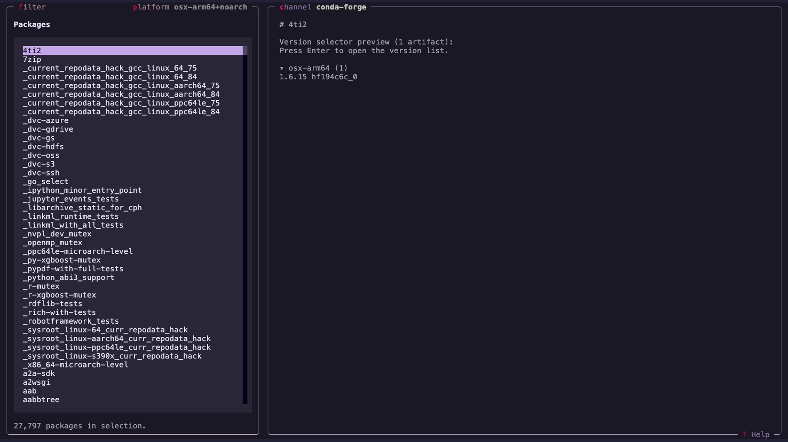

# pixi-browse

[](https://github.com/pavelzw/pixi-browse/actions/workflows/ci.yml)
[](https://prefix.dev/channels/conda-forge/packages/pixi-browse)
[](https://pypi.org/project/pixi-browse)
[](https://pypi.org/project/pixi-browse)

An interactive terminal UI for browsing conda package metadata.
Explore packages, versions, dependencies, and more from any conda channel — right from your terminal.



## Features

- **Browse packages** from any conda channel (conda-forge, prefix.dev, etc.)
- **Fuzzy search** to quickly filter through thousands of packages
- **Inspect versions** grouped by platform with collapsible sections
- **View detailed metadata** including dependencies, license, checksums, build info, and timestamps
- **Inspect package contents** — file listings and `about.json` extracted directly from artifacts
- **Clickable links** to source repositories, maintainer GitHub profiles, and provenance commits
- **Download artifacts** directly to your working directory
- **Vim-style keybindings** for fast keyboard-driven navigation

## Installation

### From conda-forge

```bash
pixi global install pixi-browse
# or use without installation
pixi exec pixi-browse
```

### From PyPI

```bash
uv tool install pixi-browse
# or use without installation
uvx pixi-browse
```

## Usage

```bash
# Browse conda-forge (default)
pixi-browse

# Browse a different channel
pixi-browse -c prefix.dev/conda-forge

# Restrict to specific platforms
pixi-browse -p linux-64 -p osx-arm64

# Show version
pixi-browse --version
```

### CLI Options

| Option             | Description                                         |
| ------------------ | --------------------------------------------------- |
| `-c`, `--channel`  | Channel to load at startup (default: `conda-forge`) |
| `-p`, `--platform` | Platforms to include (repeat for multiple)          |
| `--version`        | Show version and exit                               |
| `--help`           | Show help and exit                                  |

## Keybindings

### Navigation

| Key                 | Action                        |
| ------------------- | ----------------------------- |
| `j` / `k`           | Move selection or scroll      |
| `h` / `l`           | Focus left / right pane       |
| `gg` / `G`          | Jump to top / bottom          |
| `Ctrl+u` / `Ctrl+d` | Page up / down                |
| `Enter`             | Open / select                 |
| `Esc`               | Back or close current overlay |

### App

| Key        | Action                                        |
| ---------- | --------------------------------------------- |
| `?`        | Show help                                     |
| `/` or `f` | Start package filter                          |
| `p`        | Open platform selector                        |
| `c`        | Edit channel                                  |
| `d`        | Download selected artifact (in versions view) |
| `q`        | Quit                                          |

## Development

This project is managed by [pixi](https://pixi.sh).

```bash
git clone https://github.com/pavelzw/pixi-browse
cd pixi-browse

pixi run pre-commit-install
pixi run postinstall
```

### Running Tests

```bash
pixi run test
```

### Linting

```bash
pixi run pre-commit-run
```
